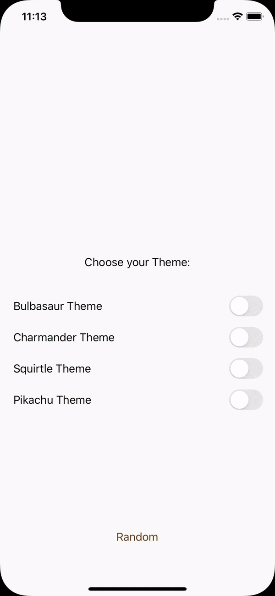

# AppTheme

An easier way to apply design language to your projects

### TODO: 

- ~~Create it as a cocoapod library~~
- ~~Create a demo project~~
- Create tests
- Add Travis CI and Codecov
- Write an awesome README ;) 

