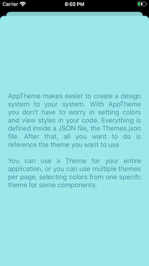
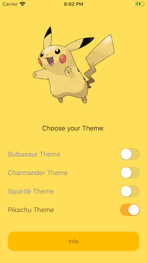

# App Theme

App Theme was develop to help you to easily implement your design system to your application. The lib provides a way to set Themes: Colors, Labels and Views properties for each system element you want. So when your're coding, you only have to referrence the design system element you want using an enum case. This way simple, like things should be 

## Catch Your Design System Now: The Pokemon Case

To illustrate how this library can help you we gonna use the sample project contained here in this project. There you can choose one of your favorite starter pokemon... i mean... theme

{:height="50%" width="50%"}
{:height="50%" width="50%"}
{:height="50%" width="50%"}
{:height="50%" width="50%"}
{:height="50%" width="50%"}
{:height="50%" width="50%"}
{:height="50%" width="50%"}
{:height="50%" width="50%"}

To easily create an app like these using dynamic themes with AppThemes, the first thing you have to do is set your Themes.json file. This is the core file of the library. Is where the AppTheme will get all the definition of all your themes. Take a look on the Themes.json found on the sample project, you can copy this to your project and use as a base.

## Who is that Pokemon? Giving names to the Colors

In the pokemon anime every pokemon has it's own name, normally (excluding the game where you can actually have this option) you don't have pokemon with different names of its original names, a bulbasaur will always be called bulbasaur, it's easier to identify that character this way right, it would be more difficult to identify each one pokemon if in the anime every trainer had their pokemon with a different name, right? So, the same thing happens with colors, we need a pattern to keep the same name for all of our system, and for all systems we develop. Gladily we don't have to waste time developing a system of colors name to use here, Google already have one that's very useful and is useful in the Material Design, cool, right? :) 

Here, every color has its function (you can take a look on all available colors that AppTheme suggests you to use in `ColorName` enum). If you want a color for a background, the one you want is the `colorPrimary`, a text color, maybe `textPrimaryColor`, something on the background, `colorSurface` or `colorOnSurface` maybe. No worries in naming colors anymore. 

But... and if you need another color that you'll be applied to an background but that background color is different of your main theme background color? Worry not my friend, just create another theme on the Themes.json file with only that color (`colorPrimary` in that case), that theme could be, for instance, an cardViewTheme that has an specific backgroundColor (`colorPrimary`) different of the main view background color, you are free to have as much themes as you want :) 

## Defining a Base Theme

A lot of talk, time to see something working. So, go ahead and set you first theme on the Themes.json file, you can simply copy and paste the base theme from the sample app, that theme already contains the definition of each available color on the library, all you need to do is to replace the values. After that, create a Controller, import AppTheme and try paint the background color with your theme's colorPrimary:

```
import AppTheme

class ViewController: UIViewController {

	override func viewDidLoad() {
		view.backgroundColor = ColorName.colorPrimary.uiColor(forTheme: .base)
	}
}

```

## Themes can have parent Themes


One thing to make easier to works with multiple themes in AppTheme is the hability of inherit from a parent theme. This way you cannot define all colors for a new theme you're setting. You can deffine for example a KangashanChild theme and set only the colors you want this themes have different from its parent. For example:

```
{
      "themeName": "kangashanChild",
      "parent": "kangashan",
      "colors": [
          {
            "name": "colorPrimary",
            "hex": "f4dc26"
          },
          {
            "name": "colorSurface",
            "hex": "5c3613"
          },
      ]
}
```

So, here if you call:

`ColorName.colorPrimary.uiColor(forTheme: .kangashanChild)`

or 

`ColorName.colorSurface.uiColor(forTheme: .kangashanChild)`

You'll have the colors defined for your theme kangashanChild. But, also, if you can still call:

`ColorName.colorSecondary.uiColor(forTheme: .kangashanChild)`

Because even that kangashanChild doens't have a colorSecondary explicitly defined, it has a parent that may have, and if its parent doens't have, it will look for the parent's parent. This logic is described here:

```
public class Theme: Codable {
    let themeName: String
    let colors: [AppColor]
    var parent: String?
    
    func color(withName colorName: String) -> AppColor? {
        if let color = colors.first(where: {$0.name == colorName}) {
            return color
        } else {
            guard let parentTheme = AppStyleSheet.shared.themes.filter({$0.themeName == parent}).first else { return nil }
            return parentTheme.color(withName: colorName)
        }
    }
}
```

## Using ViewStyles

Section in progress
